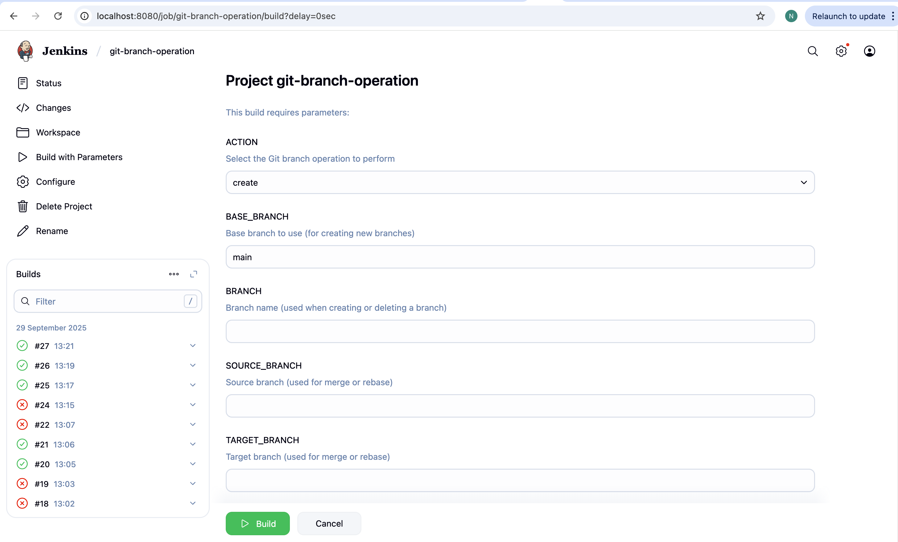
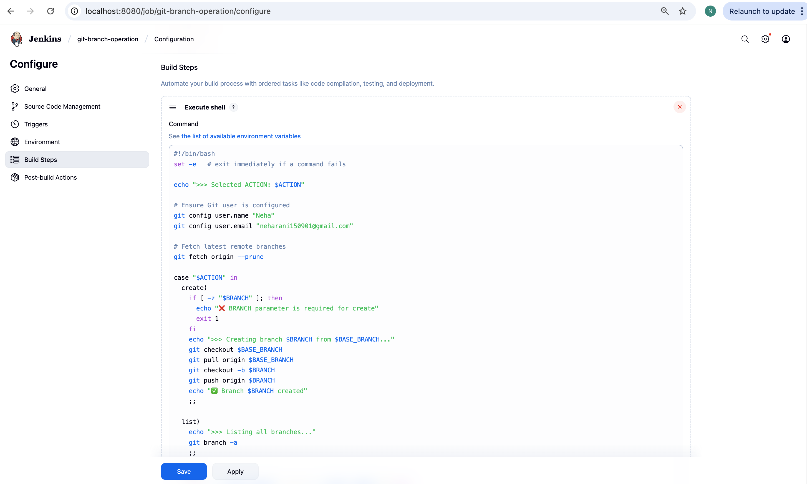
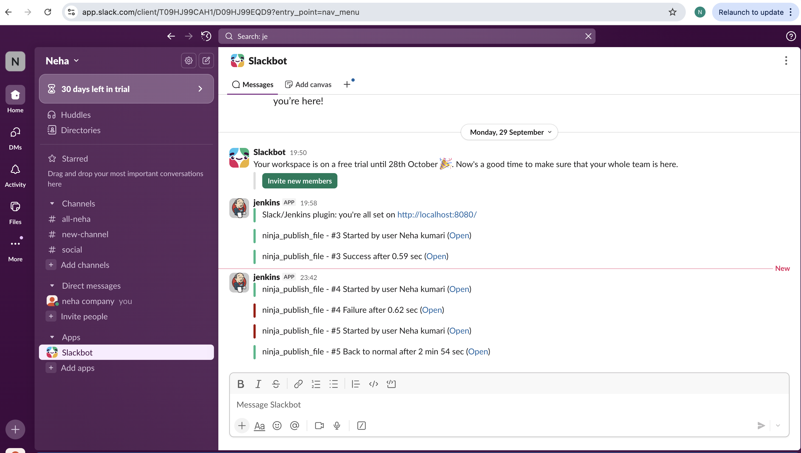
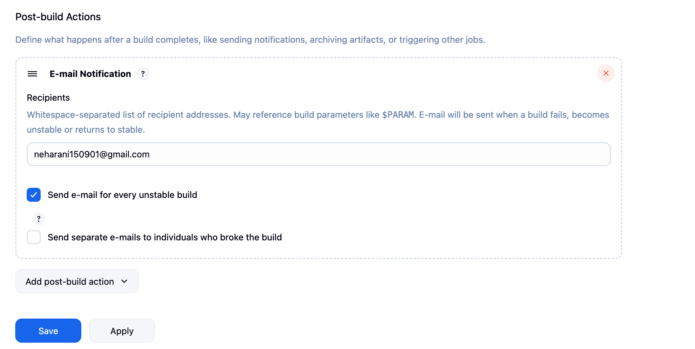
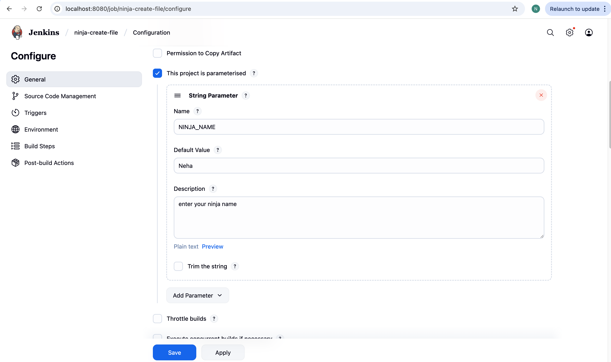
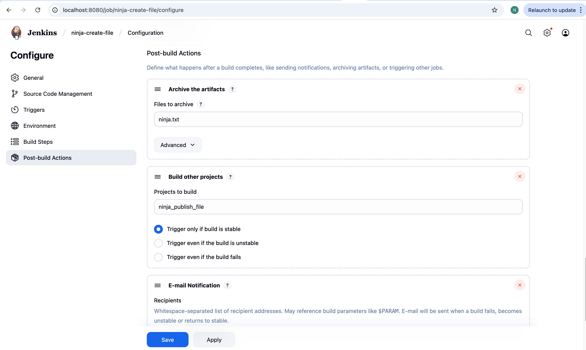
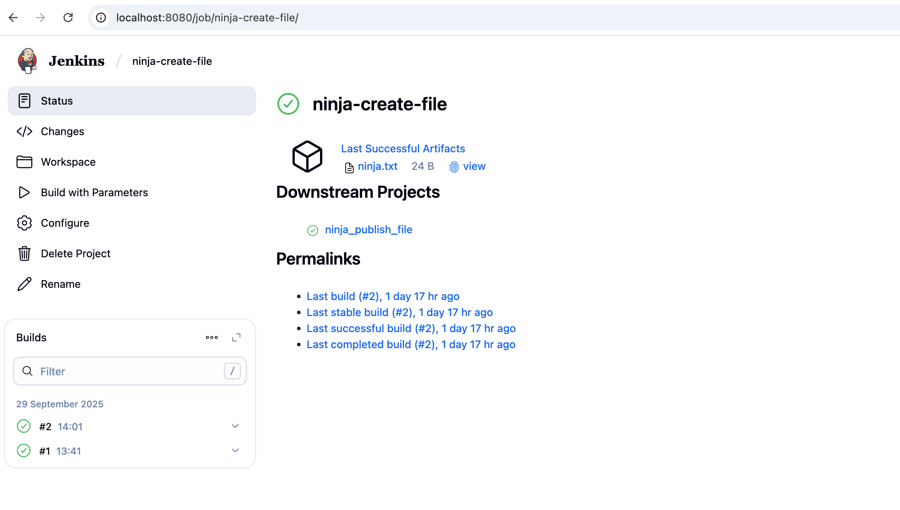
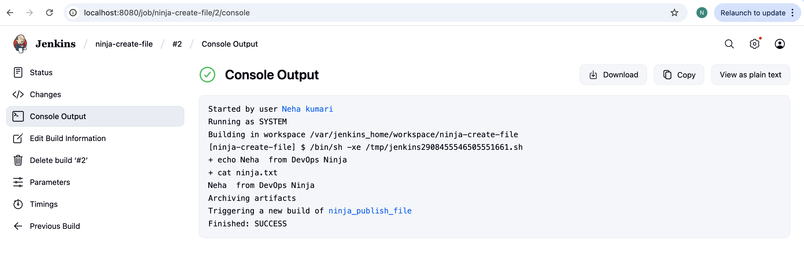
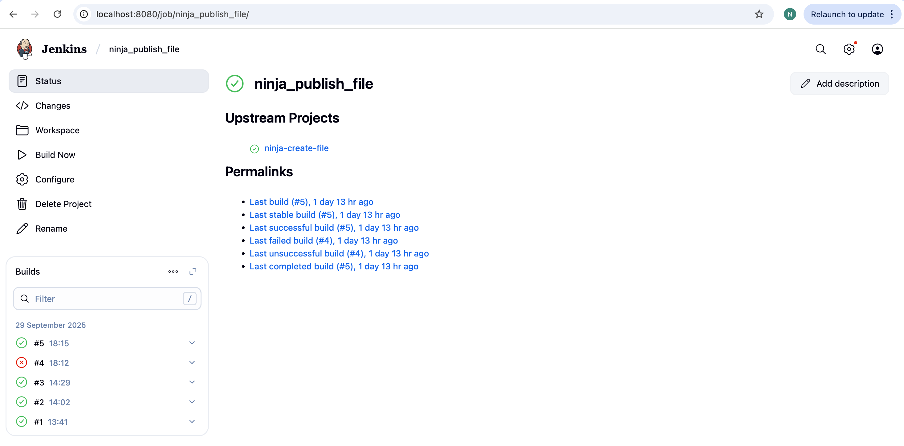
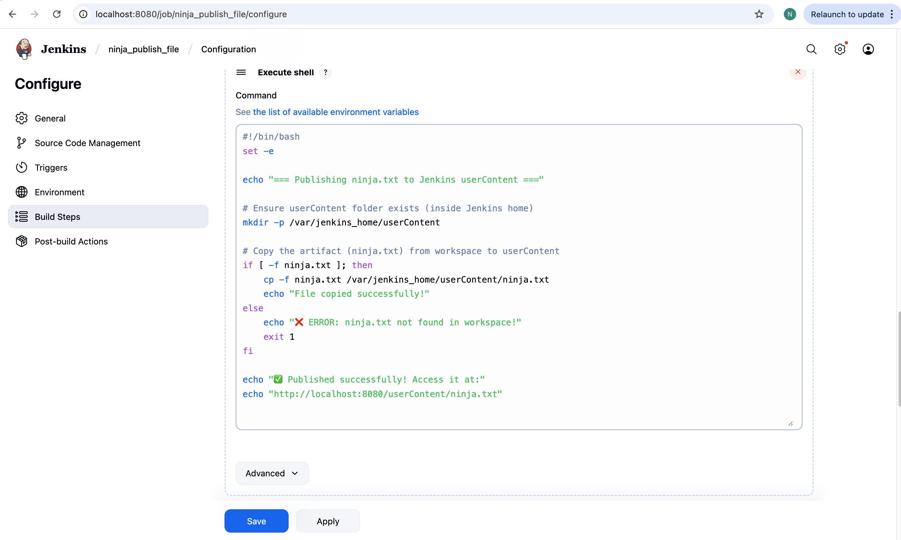

# 🚀 Assignment 1 – Jenkins CI/CD Automation

---

## 📌 Overview

This assignment demonstrates **Jenkins Freestyle Job Automation** for two parts:

1. **Part A – Git Branch Operations**
   - Create, list, merge, rebase, and delete Git branches directly from Jenkins.
   - Slack & Email notifications integrated for **success** ✅ and **failure** ❌.

2. **Part B – File Creation & Publishing**
   - Job 1: Create a file with a **custom Ninja Name**.
   - Job 2: Copy the file and **publish it via Nginx web server**.
   - Jobs are **chained** → Job 2 auto-triggers only if Job 1 succeeds.
   - Slack & Email notifications included.

---

## 🛠️ Tools & Technologies Used
- **Jenkins (Freestyle Jobs)** 🏗️
- **GitHub** (SCM integration via SSH 🔑)
- **Apache** (Web server 🌐)
- **Slack + Email** (Notifications 🔔)
- **Copy Artifact Plugin** (for inter-job communication 📂)

---

## 🎯 Part A – Git Branch Operations

### ✔️ Requirements
- Jenkins job to perform:
  - Create a branch 🪵
  - List all branches 📋
  - Merge branches 🔀
  - Rebase branches ♻️
  - Delete a branch ❌
- Notifications for success/failure.

### 📝 Steps Implemented
1. Configure **GitHub repo (SSH)** in Jenkins.

2. Add **String parameters**: `ACTION`, `BRANCH`, `SOURCE_BRANCH`, `TARGET_BRANCH`.

3. Add **Shell Script** in `Execute shell`:

   
4.Setup Slack + Email notifications in Post-build actions.

🎯 Part B – File Creation & Publishing

✔️ Requirements

Job 1 (ninja_create_file)

Input: NINJA_NAME (string parameter)

Action: Create file → ninja.txt

Content: <NINJA_NAME> from DevOps Ninja

Archive artifact for reuse.

Job 2 (ninja_publish_file)

Copy artifact (ninja.txt) from Job 1.

Chaining

Job 1 → Post-build Action → Trigger Job 2 only on success.

Notifications

Slack & Email for success and failure.

🏆 Summary

Automated Git operations via Jenkins (Part A).

Automated file creation + web publishing workflow (Part B).

Configured Slack & Email notifications.

Achieved full CI/CD pipeline using only Freestyle Jobs (no pipeline code).

✍️ Author

Neha Kumari
DevOps Ninja 💻⚡

   