📘 Assignment - 02

Topics Covered: User Authentication, User Authorization, Google SSO

🎯 Objective

The goal of this assignment is to:

Create different Jenkins jobs for Developer, Testing, and DevOps teams.

Implement Role-Based Access Control (RBAC) so each team has access only to their jobs.

Enable Single Sign-On (SSO) with Google for Jenkins login.

🏗️ Part 1 – Jenkins RBAC Setup

🔹 Step 1: Create Dummy Jobs

Developer Jobs → dev-1, dev-2, dev-3

Testing Jobs → test-1, test-2, test-3

DevOps Jobs → devops-1, devops-2, devops-3

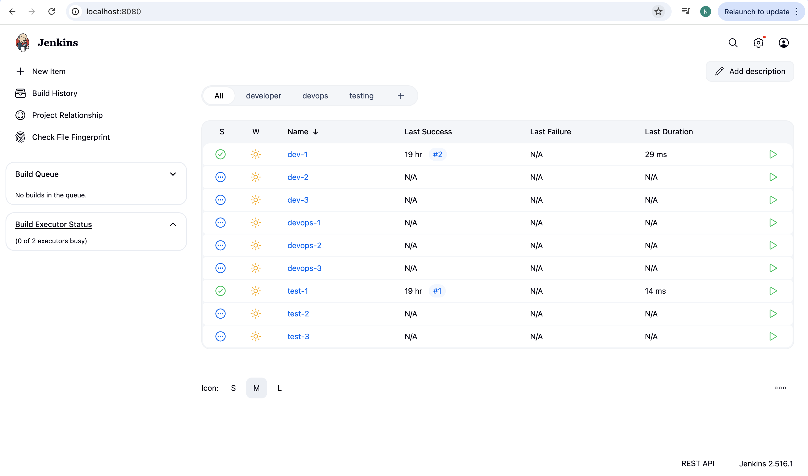

Each job has a simple shell step:

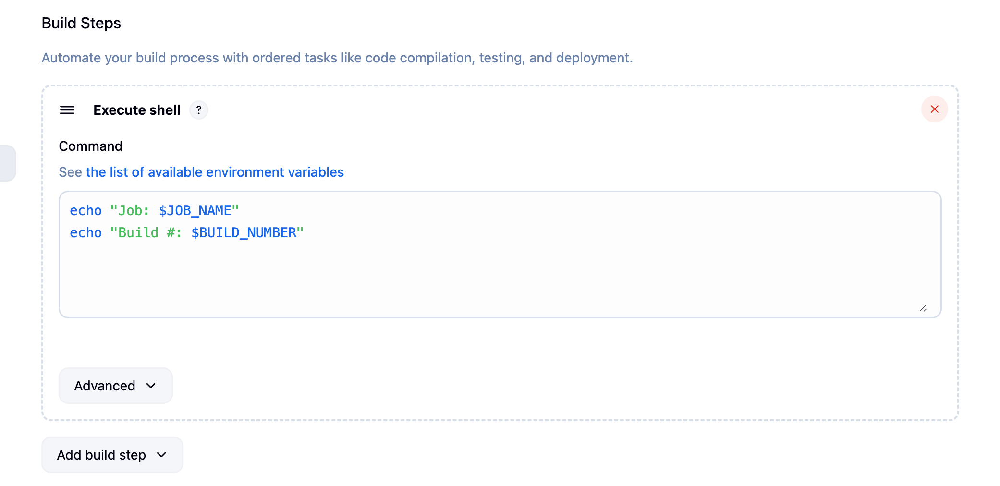

🔹 Step 2: Create Views

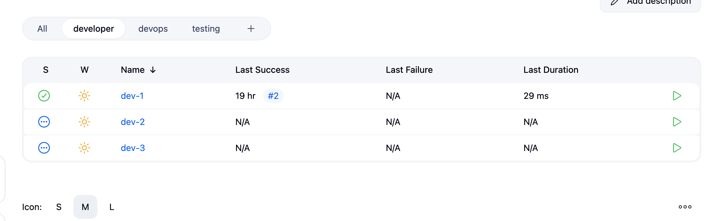

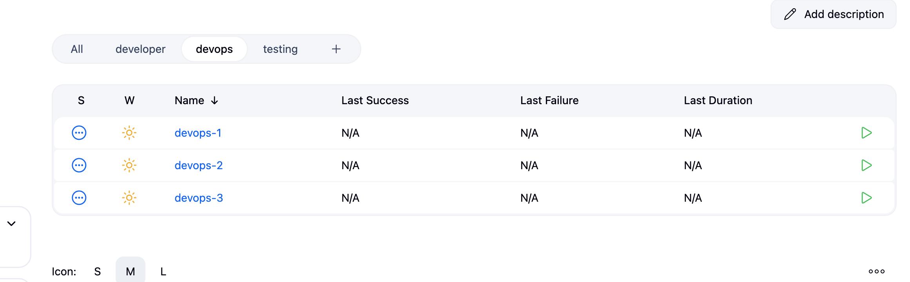

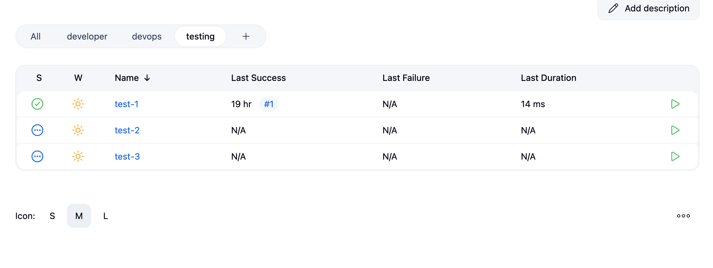

🔹 Step 3: Install & Enable Role Strategy Plugin

Manage Jenkins → Plugins → Install Role-based Authorization Strategy

Manage Jenkins → Configure Global Security → Select Role-Based Strategy

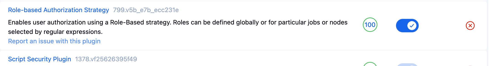

🔹 Step 4: Create Roles

dev-owners → ^dev-.* → Read, Discover, Build, Configure, Workspace

test-owners → ^test-.* → same perms for test-*

devops-owners → ^devops-.* → same perms for devops-*

test-view → ^test-.* → Read only

dev-view → ^dev-.* → Read only

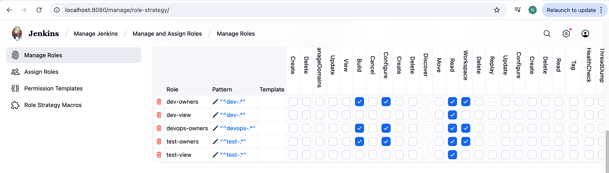

🔹 Step 5: Assign Roles

Developer team → Full control on dev-*

Testing team → Full control on test-* + Read-only dev-*

DevOps team → Full control on devops-* + Read-only dev-* + Read-only test-*

Admin  → Full access

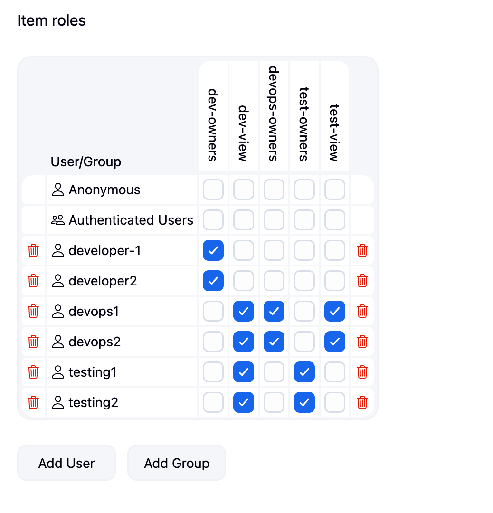

🚀 Part 2 – Enable Google SSO in Jenkins

🔹 Step 1: Create OAuth Credentials in Google Cloud Console

Go to Google Cloud Console → APIs & Services → Credentials

Create OAuth Client ID → Type = Web Application

Add Authorized Redirect URI:

http://<jenkins-url>/securityRealm/finishLogin

for my case :

Example: http://localhost:8080/securityRealm/finishLogin

🔹 Step 2: Configure Jenkins for OIDC

Manage Jenkins → Configure Global Security → OpenID Connect

Well-Known Config URL →

https://accounts.google.com/.well-known/openid-configuration

Client ID → (from Google)

Client Secret → (from Google)

Scopes → openid profile email

User name field → email

Full name field → name

Email field → email

✅ Enable Escape Hatch → Username: neha, Password: <your-password>

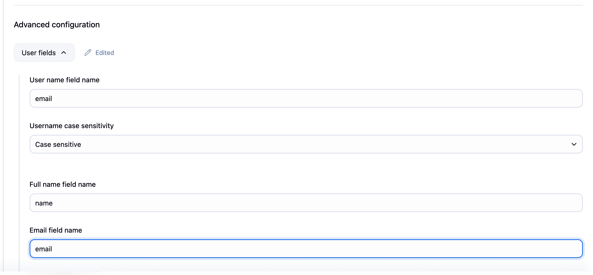

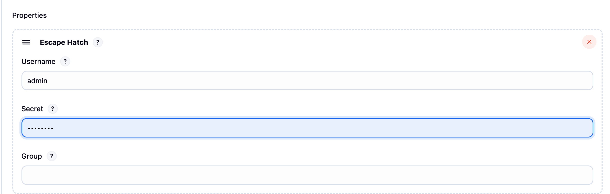

🔹 Step 3: Login with Google

Logout of Jenkins → Click Login with OpenID Connect

Select your Gmail (your-email@gmail.com)

Jenkins will log you in with your Google account

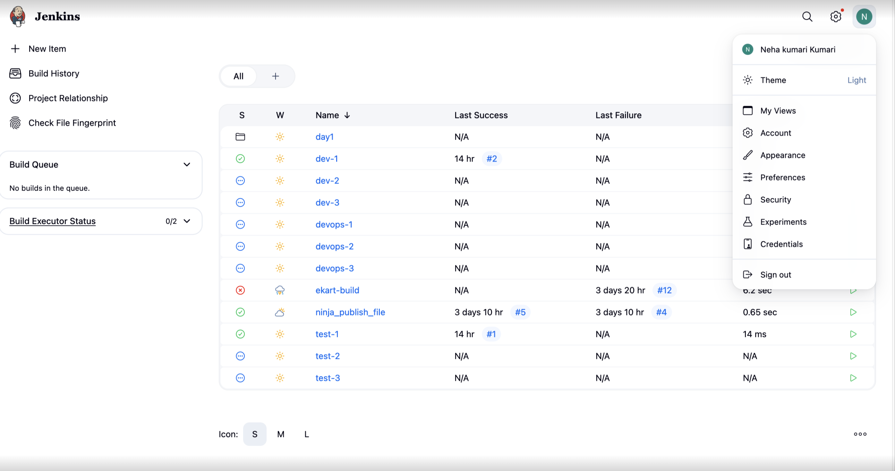

✅ Final Outcome

Developers see only their jobs.

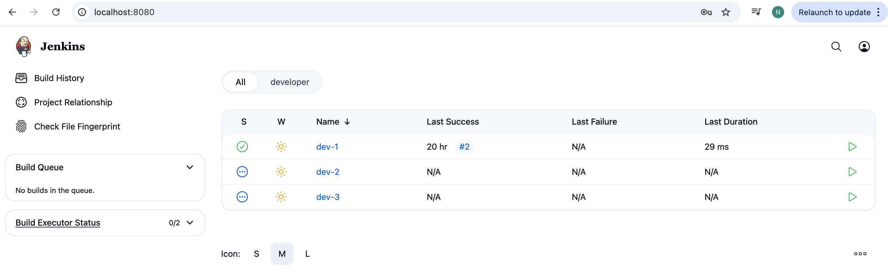

Testers see their jobs + read-only Dev jobs.

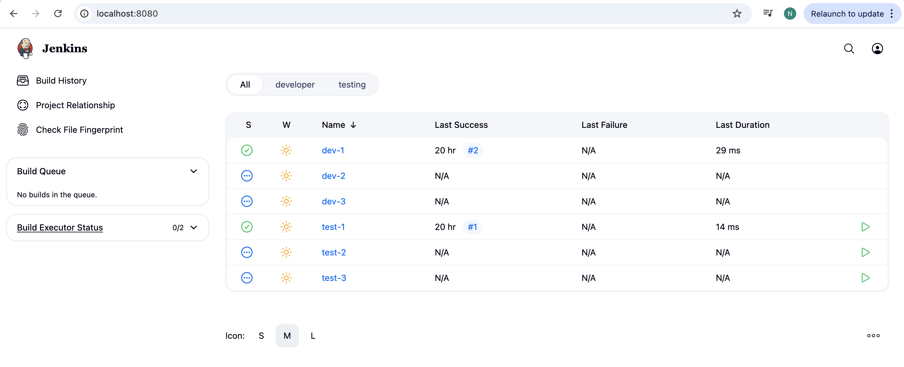

DevOps see their jobs + read-only Dev + Test jobs.

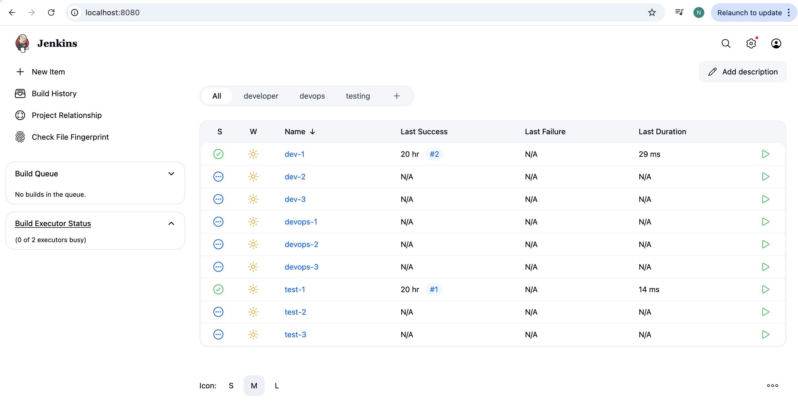

Admin (Aditi) has full access.

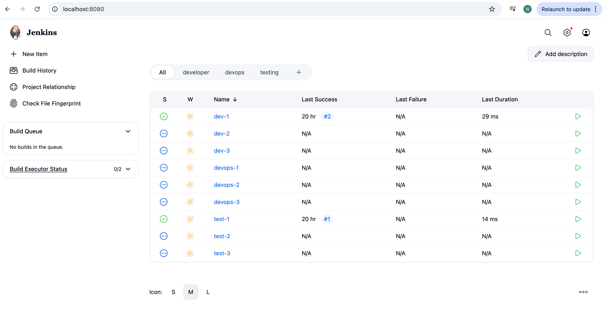

Jenkins supports Google SSO login + local login fallback.

👩‍💻 Author

Aditi ✨
