# 🚀 Assignment 3 — Continuous Integration (CI) using Jenkins

## 🎯 Objective
Perform **Continuous Integration (CI)** checks on three repositories — **Python**, **GoLang**, and **Java** — using **Jenkins Freestyle Jobs**.  
The goal is to automate **code quality checks, testing, report generation, artifact management,** and **failure notifications**.

## 🧩 Repositories Used

| Language | Repository Link | Description |
|-----------|----------------|--------------|
| 🐍 **Python** | [attendance-api](https://github.com/OT-MICROSERVICES/attendance-api) | API for attendance management |
| 🐹 **GoLang** | [employee-api](https://github.com/OT-MICROSERVICES/employee-api) | API for employee services |
| ☕ **Java** | [spring3hibernate](https://github.com/opstree/spring3hibernate.git) | Java project using Spring and Hibernate |

## ⚙️ Jenkins Setup Overview

| Component | Description |
|------------|-------------|
| 🧱 **Job Type** | Jenkins **Freestyle Jobs** |
| 🔁 **SCM** | GitHub integration with credentials |
| 🧪 **CI Checks** | Unit Testing, Code Coverage, Dependency Check, Secret Scan, Linting |
| 📦 **Artifact Management** | Store locally or remotely (e.g., Nexus/S3) |
| 📊 **Reports** | Stored in Jenkins → accessible via “Post-Build Actions” |
| 📧 **Notifications** | Email & Slack alerts on build failure |

## 🧰 Prerequisites

✅ Jenkins installed and configured  
✅ Required plugins:
- 🧩 **Git Plugin**
- 🧩 **JUnit Plugin**
- 🧩 **Cobertura / JaCoCo Plugin**
- 🧩 **Email Extension Plugin**
- 🧩 **OWASP Dependency-Check Plugin**
- 🧩 **Slack Notification Plugin**

✅ GitHub credentials added to Jenkins  
✅ Build tools installed (Python, Go, Java + Maven)

## 🏗️ Job Configuration Steps

🟦 Step 1: Create Jenkins Job

1. Open Jenkins Dashboard → Click on **“New Item”**  
2. Select **Freestyle Project** → Name it `attendance-api-ci`  
3. Click **OK**

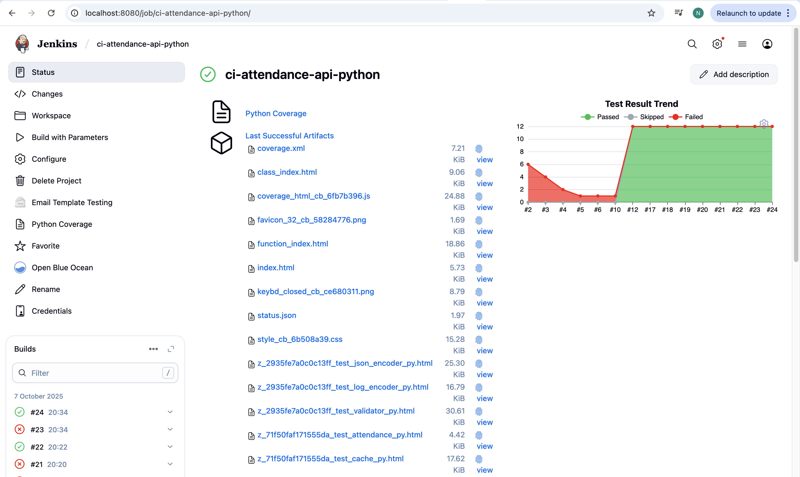

🟩 Step 2: Configure Source Code Management (SCM)

- Choose **Git**  
- Add repository URL 

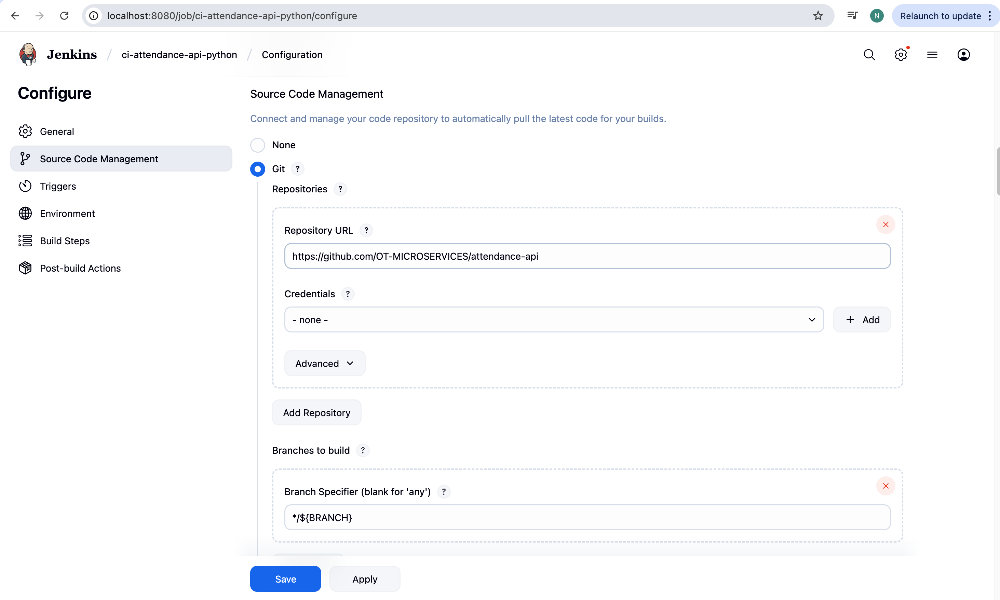

🟧 Step 3: Add Build Steps

🔹 Python (attendance-api)

# Install dependencies

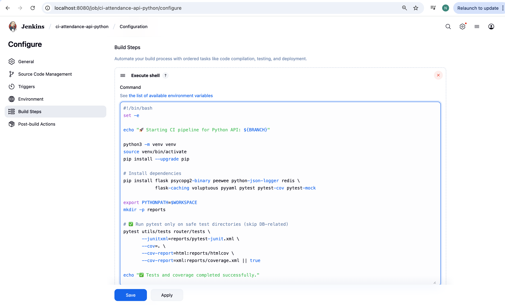

# Run tests
Archive the artifacts

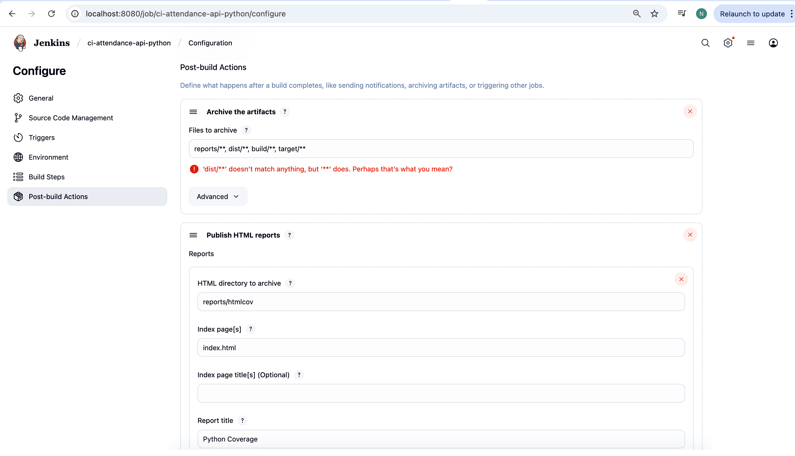

# Coverage report
Publish HTML reports

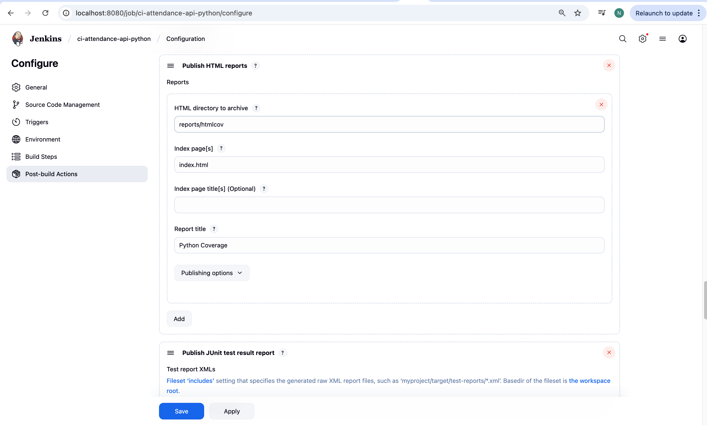

🔹 GoLang (employee-api)

# Run tests and coverage

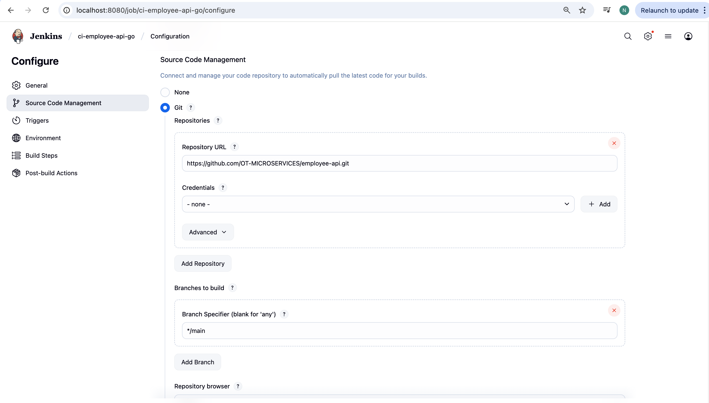

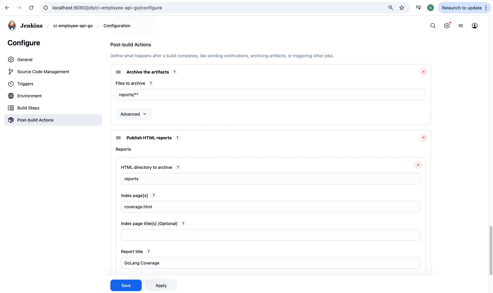

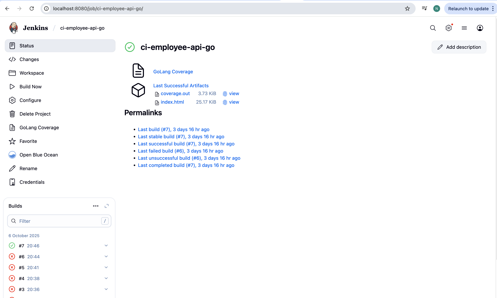

🔹 Java (spring3hibernate)

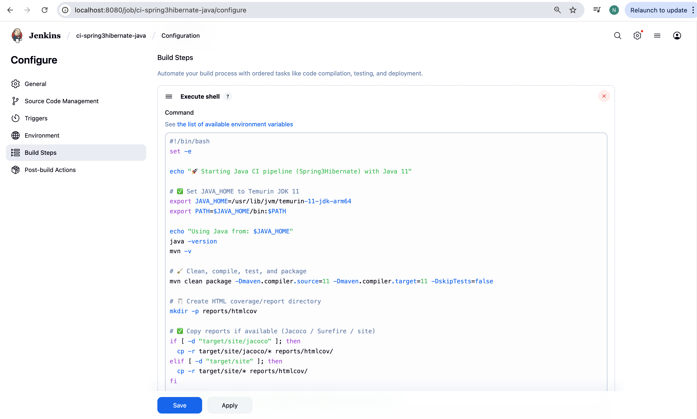

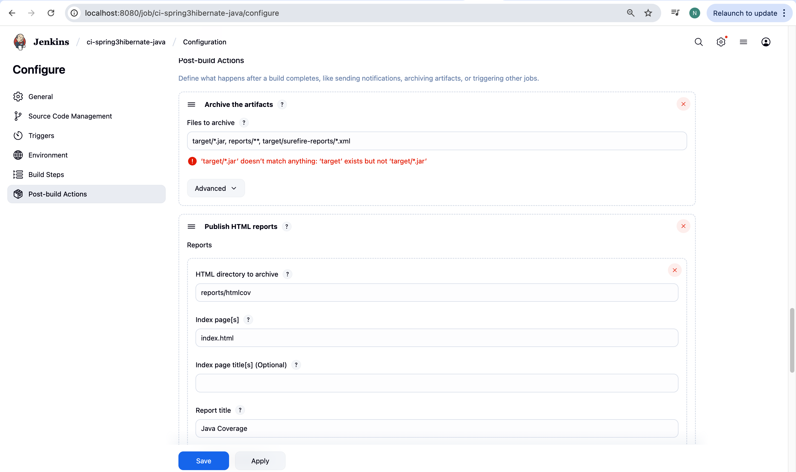

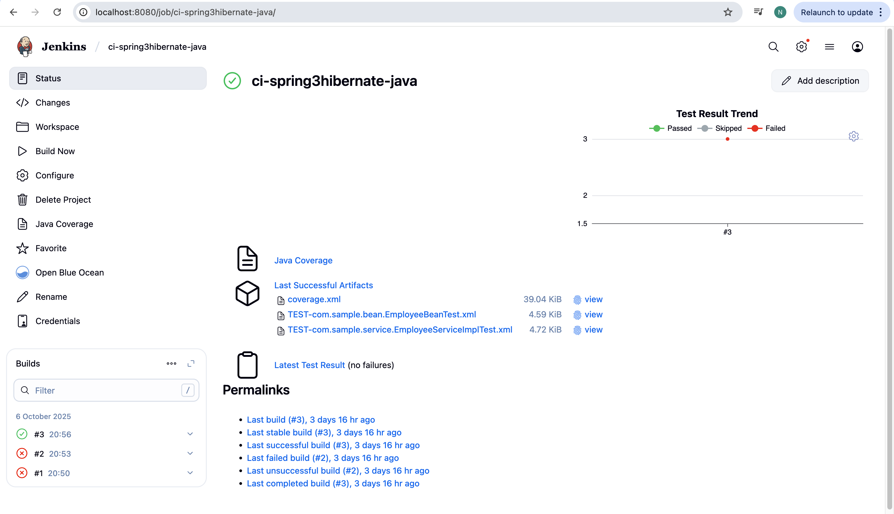

# Build and test
mvn clean test

# Generate reports
mvn cobertura:cobertura

✅ Publish JUnit test results → reports/test_results.xml

✅ Publish coverage reports (Cobertura/JaCoCo)

✅ Archive artifacts → target/*.jar, reports/*

✅ Email Notification on failure

✅ Slack Notification 

🌈 Visual Flow

flowchart LR
A[GitHub Repositories] -->|SCM Pull| B[Jenkins Freestyle Jobs]
B --> C[CI Checks: Test + Lint + Coverage + Dependency]
C --> D[Reports Stored in Jenkins]
C --> E[Artifacts Archived Locally/Remotely]
C --> F[Failure Notification via Email/Slack]

🏁 Result

✅ Automated CI pipeline for 3 repositories
✅ Reports stored & accessible in Jenkins
✅ Artifacts archived successfully
✅ Failure alerts configured via Email/Slack

🧠 Key Takeaways

Modular CI setup using Freestyle Jobs

Supports multi-language project builds

Automated testing and report publishing

Enhanced DevOps visibility with reports & alerts

🧾 Author

👩‍💻 Neha Kumari

