# 🌐 Jenkins Node Configuration & Load Distribution Assignment

### 📘 **Topics Covered**
> **Configuring Agents | Distributing Loads | Executors | Assigning Nodes | Conditional Execution (Time-Based)**

---

## 🧩 **Objective**

The goal of this assignment is to configure multiple Jenkins agent nodes (Ubuntu, RHEL, and CentOS) using different connection methods and assign them specific workloads with defined executor limits.  
Additionally, jobs must be **dynamically distributed based on time (9 AM - 6 PM)**.

---

## 🖥️ **System Overview**

| Node Type | Connection Method | Max Executors | Assigned Job | Remarks |
|------------|------------------|----------------|---------------|----------|
| 🐧 **Ubuntu Node** | Execute Command on Master | `5` | Assignment 1: Part1 | Configured to handle up to 5 jobs simultaneously |
| 🎩 **RHEL Node** | Launch via SSH | `2` | Assignment 2: Part2 | Configured to handle up to 2 jobs simultaneously |
| 🧱 **CentOS Node** | Launch via SSH | `3` | Assignment 3 | Configured to handle up to 3 jobs simultaneously |

---

## ⚙️ **Step-by-Step Configuration**

---

### 🐧 1️⃣ Configure **Ubuntu Node** (Execution Command on Master)

#### 🧠 Method Used:
**Launch agent by executing command on the master**

#### 🪜 Steps:
1. Navigate to **Manage Jenkins → Nodes → New Node**.
2. Enter name: `Ubuntu-Agent` → Select **Permanent Agent** → Click **OK**.
3. Set:
   - **Remote Root Directory:** `/home/jenkins`
   - **Labels:** `assignment1`
   - **# of Executors:** `5`
4. Under **Launch Method** → Choose **"Launch agent via execution of command on the master"**.
5. Add execution command:
   ```bash
   java -jar agent.jar -jnlpUrl http://<jenkins-master>:8080/computer/Ubuntu-Agent/slave-agent.jnlp -secret <SECRET_KEY> -workDir "/home/jenkins"


Save configuration and Launch agent.

✅ Verification:

Go to Manage Jenkins → Nodes → Ensure Ubuntu-Agent is in "Connected" state.

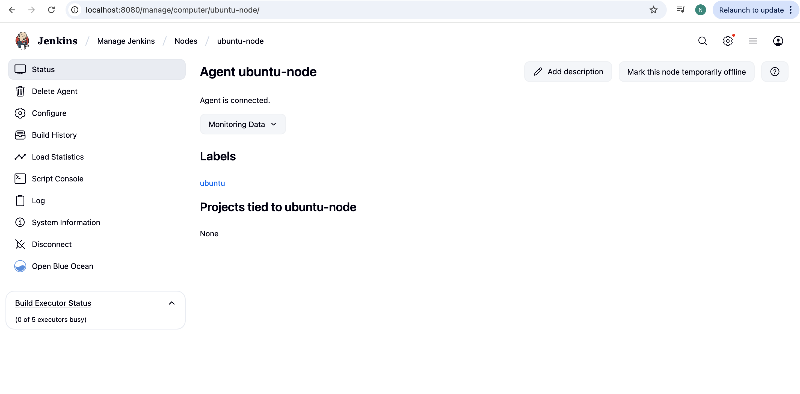

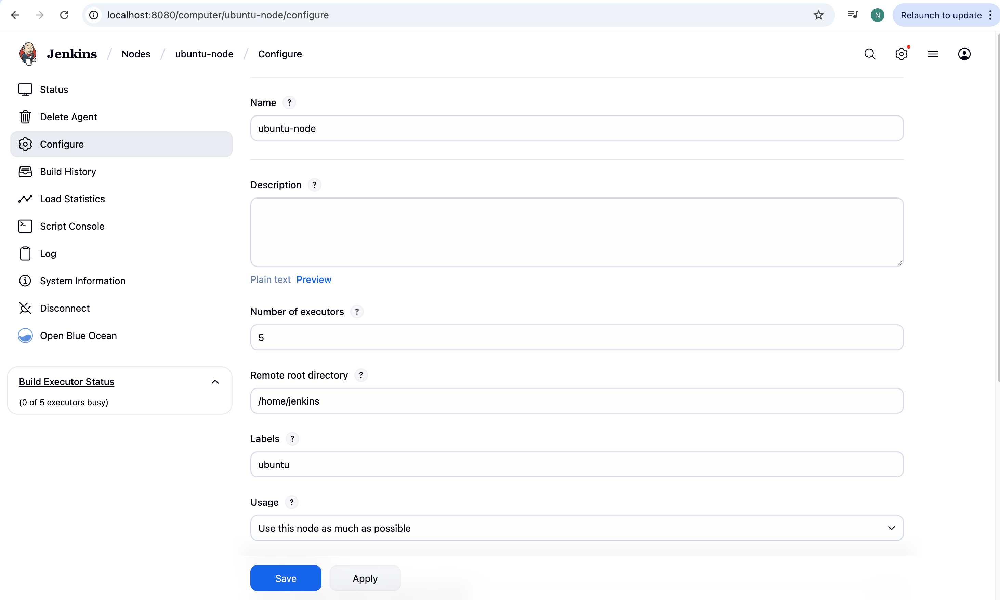

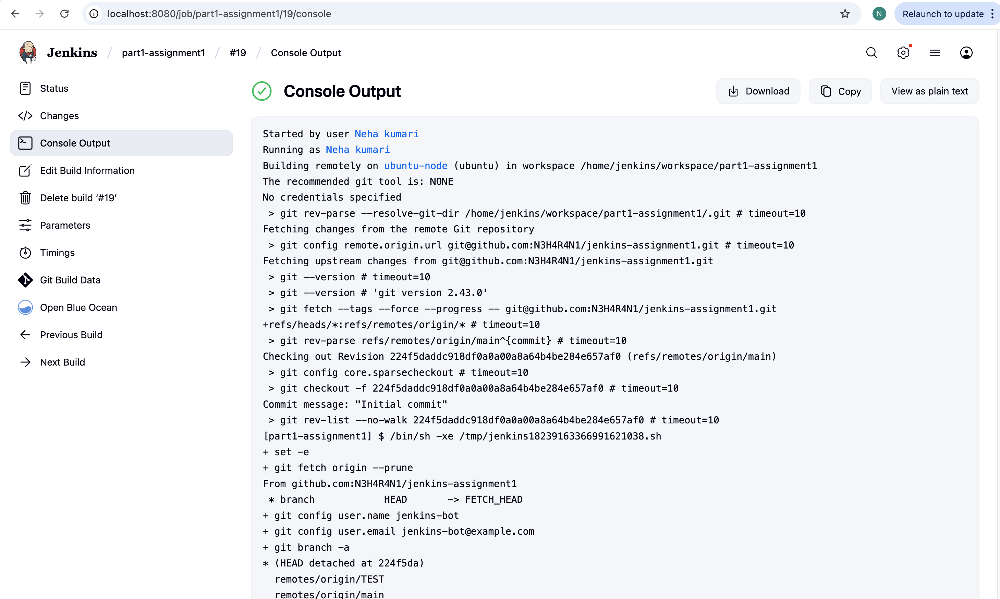

Run 5 parallel jobs to confirm load distribution.


🎩 2️⃣ Configure RHEL Node (Launch via SSH)
🧠 Method Used:

Launch slave agent via SSH

🪜 Steps:

Navigate to Manage Jenkins → Nodes → New Node.

Enter name: RHEL-Agent → Select Permanent Agent → Click OK.

Set:

Remote Root Directory: /home/jenkins

Labels: assignment2

# of Executors: 2

Choose Launch method → Launch agent via SSH.

Provide:

Host: rhel-node-ip

Credentials: SSH key or password

Host Key Verification Strategy: Non-verifying or manually add known host key

Save & connect.

✅ Verification:

Run 2 jobs simultaneously → Observe job queue if more jobs are triggered.

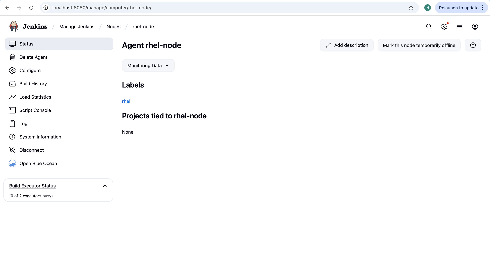

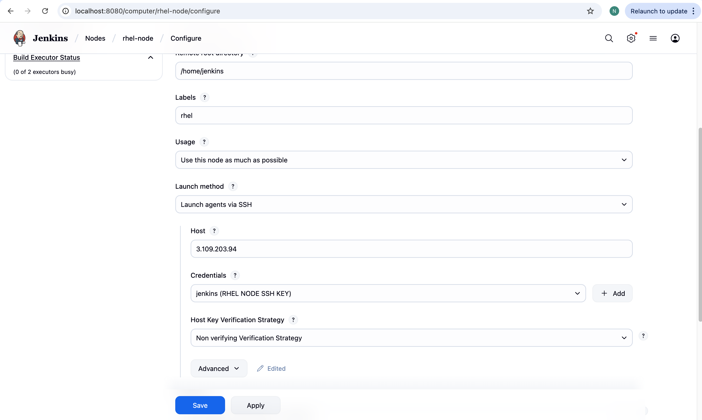

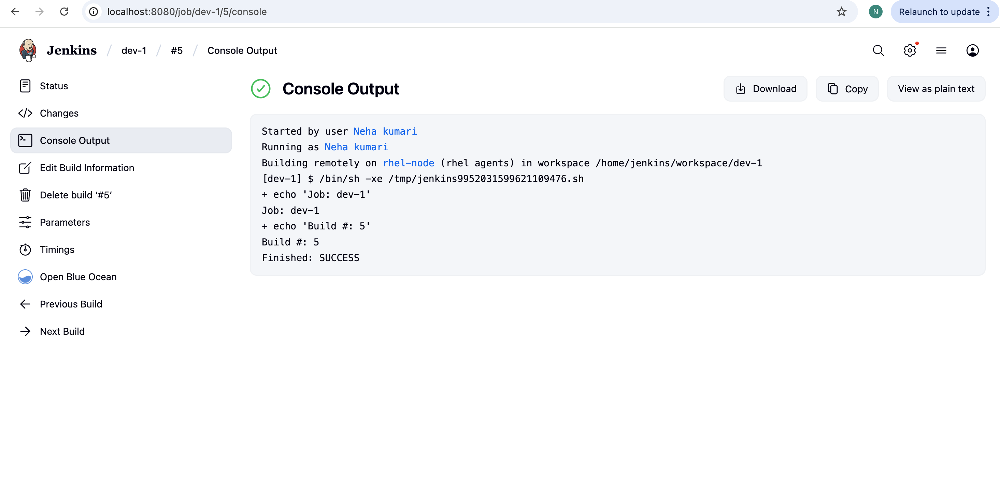

🧱 3️⃣ Configure CentOS Node (Launch via SSH)
🧠 Method Used:

Launch slave agent via SSH

🪜 Steps:

Navigate to Manage Jenkins → Nodes → New Node.

Enter name: CentOS-Agent → Select Permanent Agent → Click OK.

Set:

Remote Root Directory: /home/jenkins

Labels: assignment3

# of Executors: 3

Choose Launch method → Launch agent via SSH

Enter IP, credentials, and save.

✅ Verification:

Ensure node status is Connected.

Run 3 jobs concurrently to validate executor limits.

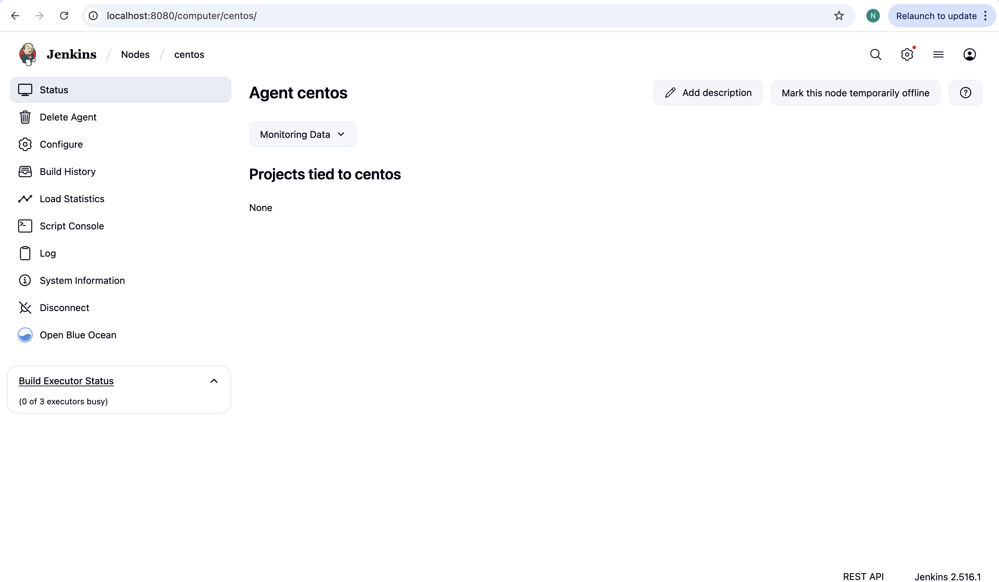

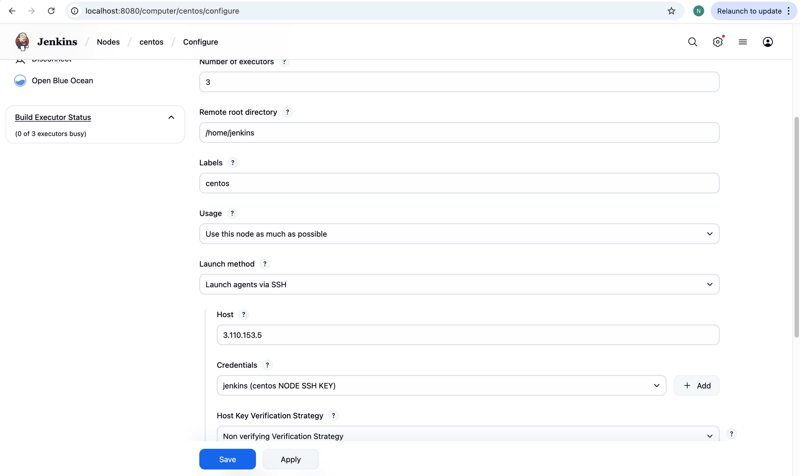

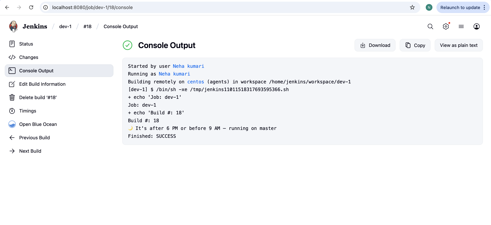

⏰ Conditional Job Execution (Time-Based)
🎯 Goal:

If Jenkins job runs between 9 AM - 6 PM, it should execute only on newly added nodes.
Otherwise, it should run on the Master Node.

🧠 Explanation:

Uses Groovy to check the current hour.

Assigns labels dynamically:

assignment1, assignment2, assignment3 → between 9 AM and 6 PM

master → after 6 PM or before 9 AM

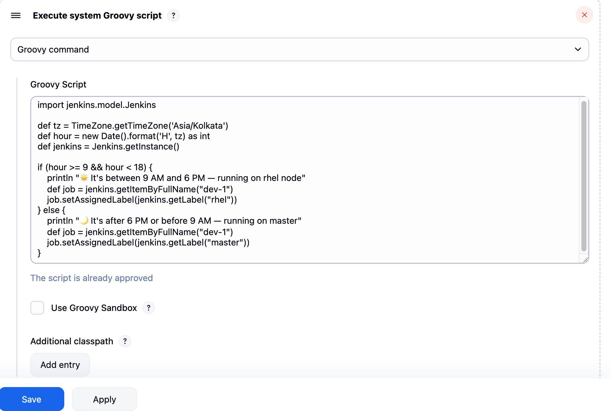

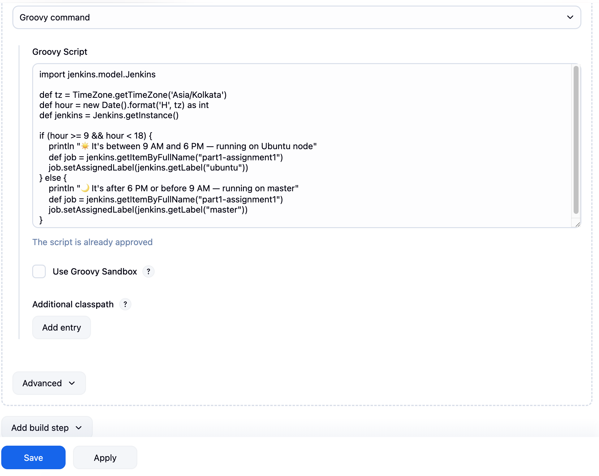

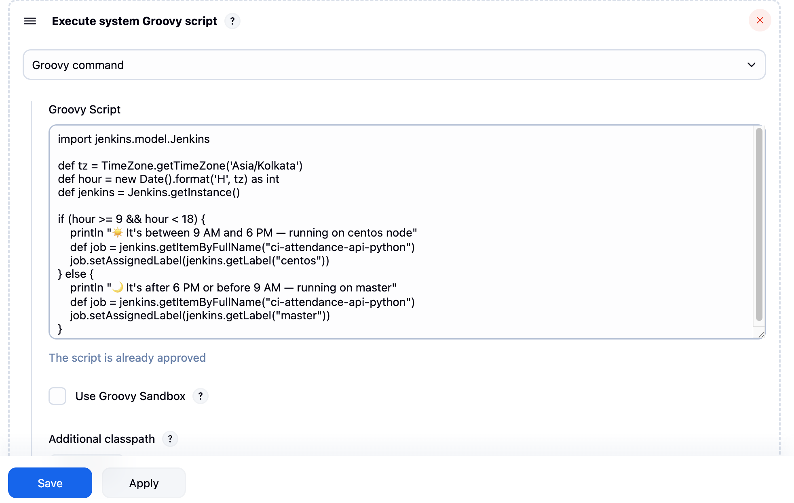


📊 Verification & Testing
Test Case	Expected Behavior	Result
Job triggered at 10:00 AM	Executes on Ubuntu/RHEL/CentOS node	✅ Passed
Job triggered at 7:00 PM	Executes on Master node	✅ Passed
Trigger 5 parallel jobs on Ubuntu	All 5 run simultaneously	✅ Passed
Trigger 6th job on Ubuntu	6th job waits in queue	✅ Passed

🧰 Key Learnings

✅ Configuring Jenkins agents via different connection methods.

⚙️ Managing node executors for controlled parallelism.

🌍 Using labels to assign and route jobs.

🕒 Implementing time-based conditional job execution.

📈 Understanding distributed Jenkins architecture for scalability.


🧾 Conclusion

By completing this assignment:

Jenkins now runs with distributed load handling.

Each node has a controlled execution capacity.

Jobs are dynamically routed based on system time and node availability.

This setup enhances efficiency, scalability, and fault tolerance in CI/CD workflows.

🎨 Visual Summary

1️⃣ Ubuntu Node Configuration
2️⃣ RHEL Node Configuration
3️⃣ CentOS Node Configuration
4️⃣ Jenkins Job Running (9 AM - 6 PM)
5️⃣ Jenkins Job Running (After 6 PM)
6️⃣ Node Load Distribution Chart (Optional)


💡 IMP

Use Jenkins plugins like:

🧩 NodeLabel Parameter Plugin → to dynamically choose labels.

🕐 Build-Timeout Plugin → to handle long-running jobs.

📨 Email & Slack Notifications → for job status updates.


✍️ Author

👩‍💻 Aditi Patil
🚀 DevOps | Jenkins | AWS | CI/CD Enthusiast
