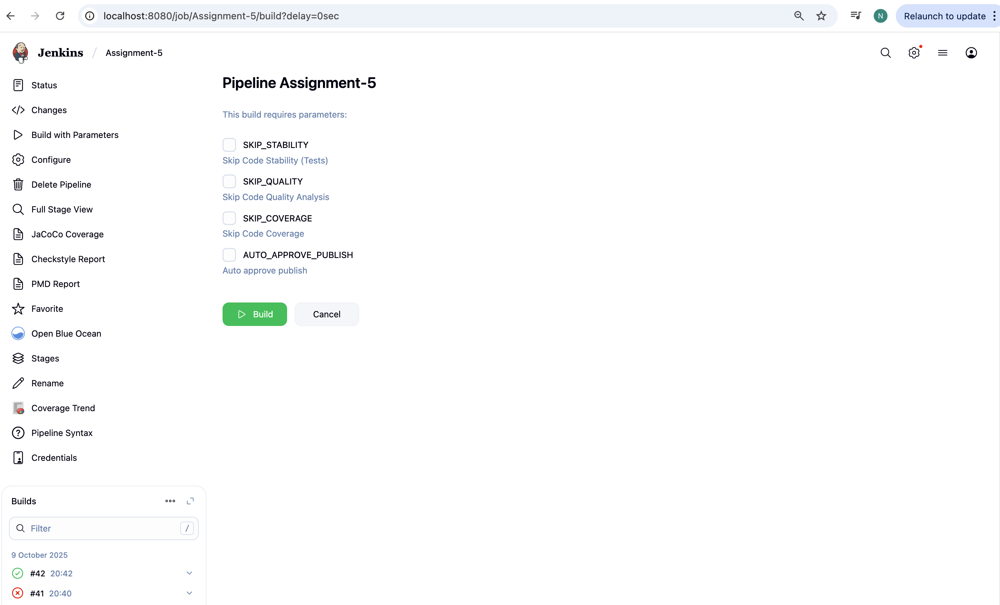
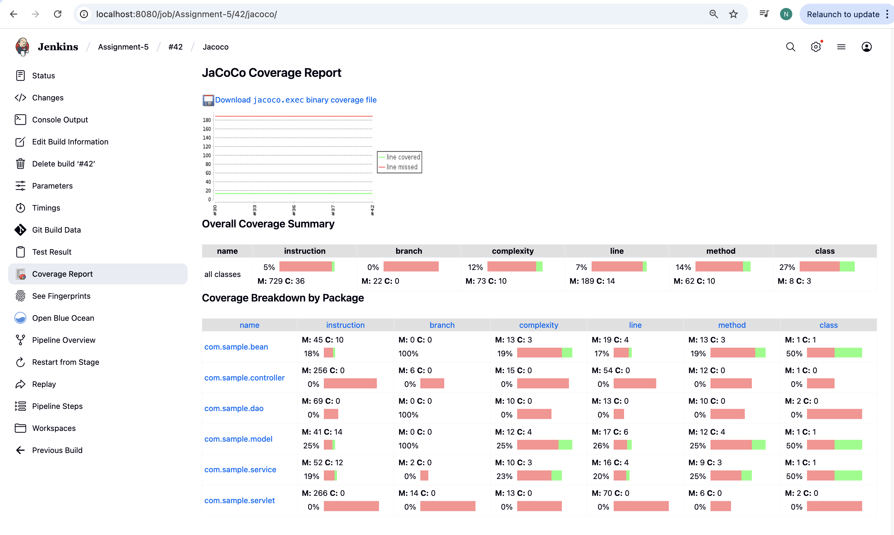
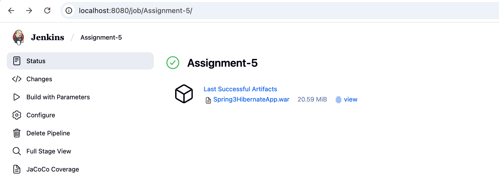
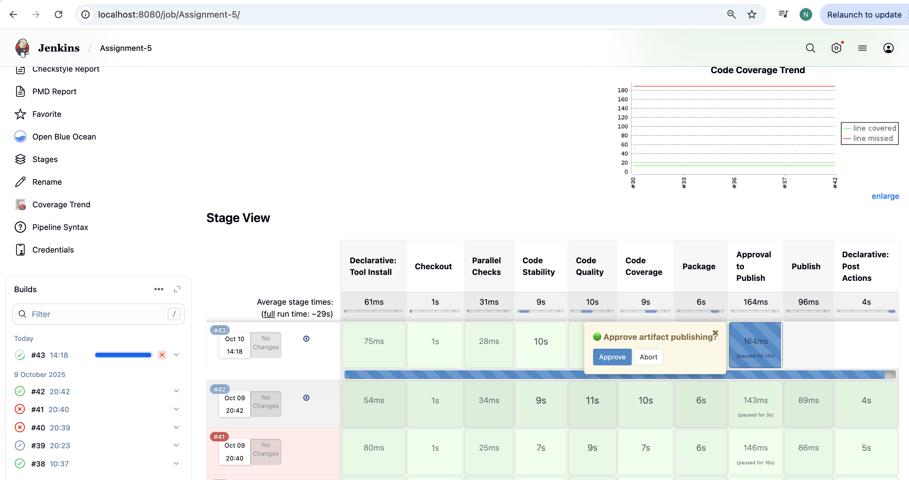
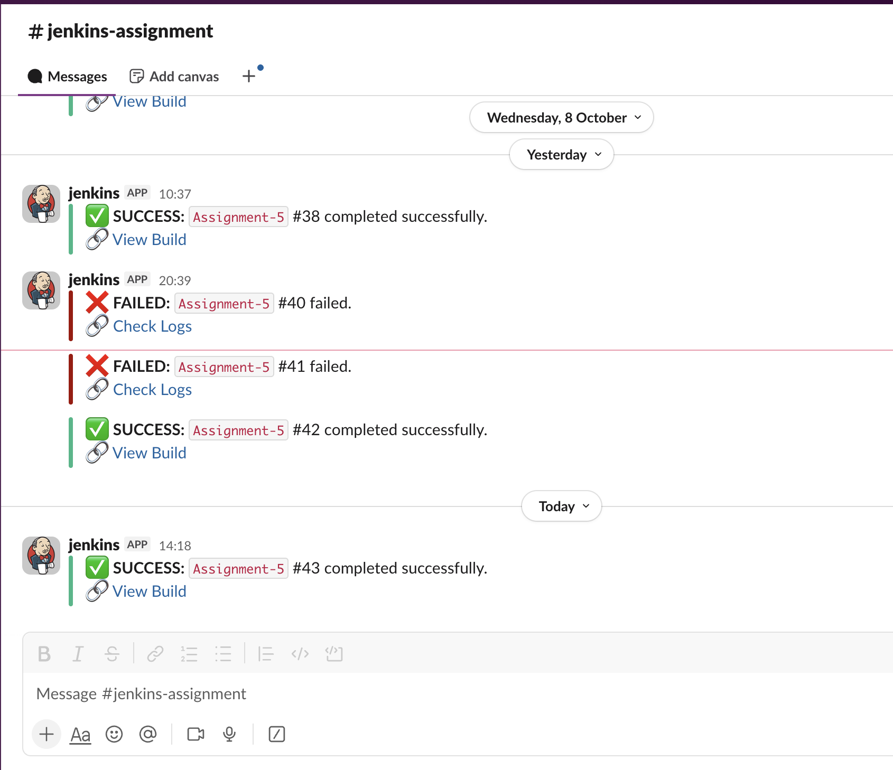
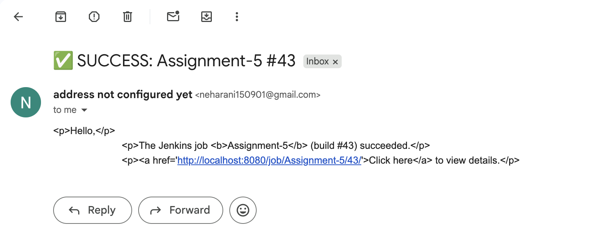

🌟 Assignment 5 — Declarative CI Pipeline for Java Project
🧭 Objective

🚀 Designed and implemented a Jenkins Declarative CI Pipeline for a Java-based project featuring parallel build stages, code quality & coverage reports, artifact publishing, and Slack + Email notifications with manual approval control before deployment.
💡 Includes parameterized build options for skipping scans and auto-approving publish steps.

🧩 Pipeline Design — Overview Diagram

graph TD
A[Start Pipeline] --> B[Code Checkout]
B --> C{Parallel Checks}
C -->|1️⃣| D[Code Stability]
C -->|2️⃣| E[Code Quality Analysis]
C -->|3️⃣| F[Code Coverage Analysis]
D --> G[Package Stage]
E --> G
F --> G
G --> H{Approval Stage}
H -->|Approve| I[Publish Artifact]
H -->|Reject| X[Abort Build]
I --> J[Slack + Email Notifications]
J --> K[End ✅]

⚙️ Configuration Details

🧰 Tools Used

| Tool                       | Version    | Purpose                       |
| -------------------------- | ---------- | ----------------------------- |
| **Jenkins**                | Latest LTS | CI/CD automation              |
| **JDK**                    | Java 11    | Compilation and testing       |
| **Maven**                  | mvn3       | Build & dependency management |
| **Slack Plugin**           | Latest     | Notifications                 |
| **Email Extension Plugin** | Latest     | Email alerts                  |
| **HTML Publisher Plugin**  | Latest     | Publish reports               |
| **JaCoCo Plugin**          | Latest     | Code coverage reports         |

🧑‍💻 Pipeline Parameters

| Parameter              | Type    | Description                               |
| ---------------------- | ------- | ----------------------------------------- |
| `SKIP_STABILITY`       | Boolean | Skip Code Stability tests                 |
| `SKIP_QUALITY`         | Boolean | Skip Code Quality checks                  |
| `SKIP_COVERAGE`        | Boolean | Skip Code Coverage stage                  |
| `AUTO_APPROVE_PUBLISH` | Boolean | Automatically approve artifact publishing |




🏗️ Jenkinsfile Breakdown

🔹 Checkout Stage

Fetches the Java project from GitHub.

```

stage('Checkout') {
    steps {
        git branch: 'master', url: 'https://github.com/opstree/spring3hibernate.git'
    }
}

```

🔹 Parallel Checks

Runs the following three scans in parallel to save time:

🧱 Code Stability

Runs unit tests using Maven and publishes JUnit results.
📸 (Add screenshot of test results here)

🔍 Code Quality Analysis

Executes Checkstyle, PMD, and FindBugs scans.
Publishes HTML reports for all.
📸 (Add screenshot of reports here)

📊 Code Coverage

Generates JaCoCo coverage report and HTML view.



🔹 Packaging

Builds and archives the final WAR artifact.



```
stage('Package') {
    steps {
        sh 'mvn clean package -DskipTests'
    }
    post {
        success {
            archiveArtifacts artifacts: 'target/*.war', fingerprint: true
        }
    }
}
```

🔹 Approval to Publish

Manual input or auto-approval based on user parameter.

```
if (!params.AUTO_APPROVE_PUBLISH) {
    input message: '🟢 Approve artifact publishing?', ok: 'Approve'
} else {
    echo '✅ Auto-approval enabled'
}
```



✉️ Notifications
🔸 Slack Notification

Success → Green ✅

Failure → Red ❌

Unstable → Yellow ⚠️

```
slackSend(
  channel: env.SLACK_CHANNEL,
  color: 'good',
  message: "✅ Build Success for ${env.JOB_NAME} #${env.BUILD_NUMBER}"
)
```



🔸 Email Notification

Sent on Success / Failure via emailext plugin.

```
emailext(
  to: env.EMAIL_TO,
  subject: "✅ SUCCESS: ${env.JOB_NAME} #${env.BUILD_NUMBER}",
  body: """<p>Build successful!</p><a href='${env.BUILD_URL}'>View Details</a>"""
)
```




🧾 Reports Generated

| Report Type            | Plugin                  | Location                      |
| ---------------------- | ----------------------- | ----------------------------- |
| **JUnit Test Results** | JUnit Plugin            | target/surefire-reports       |
| **Checkstyle Report**  | HTML Publisher          | target/site/checkstyle.html   |
| **PMD Report**         | HTML Publisher          | target/site/pmd.html          |
| **FindBugs Report**    | HTML Publisher          | target/site/findbugs.html     |
| **JaCoCo Coverage**    | JaCoCo + HTML Publisher | target/site/jacoco/index.html |


🧠 Key Learnings

✅ How to design declarative pipelines
✅ Using parallel execution for faster builds
✅ Integrating static analysis tools
✅ Implementing conditional execution using parameters
✅ Setting up Slack and Email alerts
✅ Introducing manual approval gates before publishing


🏁 Final Output Summary

| Stage          | Status | Report/Artifact               |
| -------------- | ------ | ----------------------------- |
| Checkout       | ✅      | Code cloned successfully      |
| Code Stability | ✅      | JUnit Report                  |
| Code Quality   | ✅      | Checkstyle, PMD, FindBugs     |
| Code Coverage  | ✅      | JaCoCo Report                 |
| Package        | ✅      | `target/spring3hibernate.war` |
| Approval       | ⏳/✅    | Manual or Auto                |
| Publish        | ✅      | Artifact uploaded             |
| Notifications  | ✅      | Slack + Email sent            |


👨‍💻 Author

🧑‍💻 Aditi
DevOps Engineer | Jenkins | AWS | Kubernetes | CI/CD Automation | Linux | git | Maven | Ansible
📧 aditipatil20255@gmail.com

